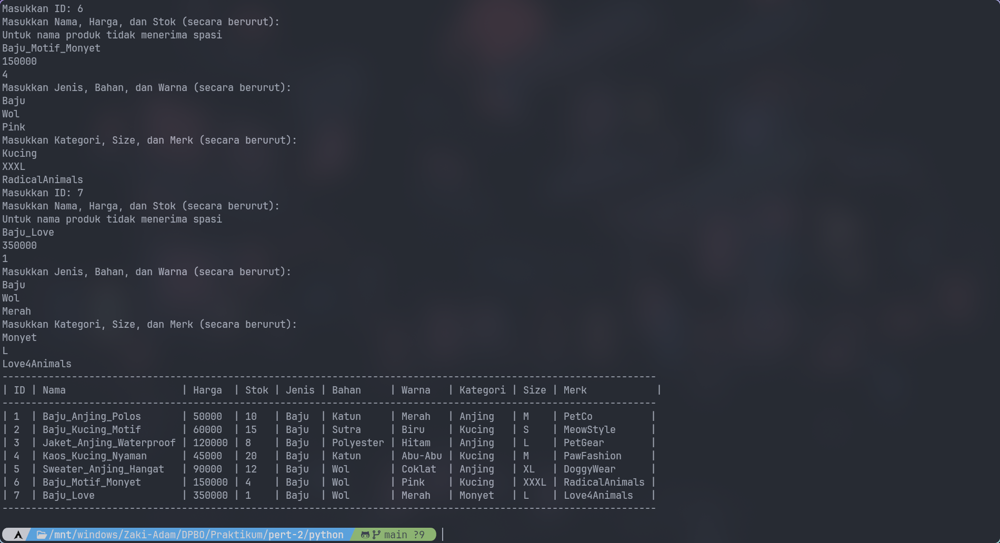

# TP2DPBO2025C2
Saya Zaki Adam dengan NIM 2304934 mengerjakan Tugas Praktikum 2 dalam mata kuliah Desain dan Pemrograman Berorientasi Objek untuk Keberkahan-Nya maka saya tidak akan melakukan kecurangan seperti yang telah dispesifikasikan. Aamiin.

## Desain Program

Program terdiri dari 3 kelas yaitu, PetShop, Aksesoris, dan Baju.

### PetShop
Class `PetShop` terdiri dari atribut:
* `ID` - ID dari produk
* `Nama` - Nama dari produk
* `Harga` - Harga produk tersebut
* `Stok` - Sisa stok produk tersedia
* **(Khusus PHP)** `Gambar` - Gambar produk tersebut

Method `PetShop` terdiri dari:
#### Getter Methods:
* `getID()` - Mengembalikan nilai ID produk.
* `getNama()` - Mengembalikan nama produk.
* `getHarga()` - Mengembalikan harga produk.
* `getStok()` - Mengembalikan stok produk yang tersedia.
* **(Khusus PHP)** `getGambar()` - Mengembalikan gambar produk.

#### Setter Methods:
* `setID(id)` - Mengubah ID produk dengan nilai baru.
* `setNama(nama)` - Mengubah nama produk dengan nilai baru.
* `setHarga(harga)` - Mengubah harga produk dengan nilai baru, dapat divalidasi agar tidak negatif.
* `setStok(stok)` - Mengubah stok produk dengan nilai baru, dapat divalidasi agar tidak negatif.
* **(Khusus PHP)** `setGambar(gambar)` - Mengubah gambar produk.

### Aksesoris
Class `Aksesoris` merupakan anak/extend dari `PetShop`, terdiri dari atribut tambahan:
* `Jenis` - Jenis dari produk tersebut (baju, celana, boneka)
* `Bahan` - Bahan produk tersebut terbuat
* `Warna` - Warna produk tersebut

#### Getter Methods:
* `getJenis()` - Mengembalikan jenis produk.
* `getBahan()` - Mengembalikan bahan produk.
* `getWarna()` - Mengembalikan warna produk.

#### Setter Methods:
* `setJenis(jenis)` - Mengubah jenis produk dengan nilai baru.
* `setBahan(bahan)` - Mengubah bahan produk dengan nilai baru.
* `setWarna(warna)` - Mengubah warna produk dengan nilai baru.

### Baju
Class `Baju` merupakan anak/extend dari `Aksesoris`, terdiri dari atribut tambahan:
* `Kategori` - Produk ini digunakan untuk hewan apa
* `Size` - Ukuran baju dari produk tersebut
* `Merk` - Brand/merk yang membuat baju tersebut

#### Getter Methods:
* `getKategori()` - Mengembalikan kategori penggunaan produk.
* `getSize()` - Mengembalikan ukuran baju.
* `getMerk()` - Mengembalikan merk baju.

#### Setter Methods:
* `setKategori(kategori)` - Mengubah kategori produk dengan nilai baru.
* `setSize(size)` - Mengubah ukuran baju dengan nilai baru.
* `setMerk(merk)` - Mengubah merk baju dengan nilai baru.

## Alur Program
1. Kompilasi program sesuai bahasa pemrograman yang dijalankan
2. Pada awal jalan kode akan menginput/menambahkan 5 data secara manual ke dalam program
3. Meminta jumlah data yang ingin dimasukkan
4. Memasukkan data baru sesuai jumlah yang diminta
5. Membuat tabel objek-objeknya

## Dokumentasi
### C++

### Java

### Python

### PHP

